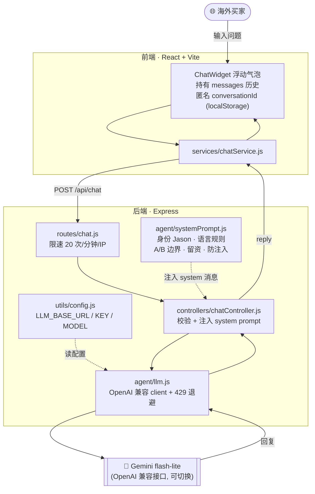
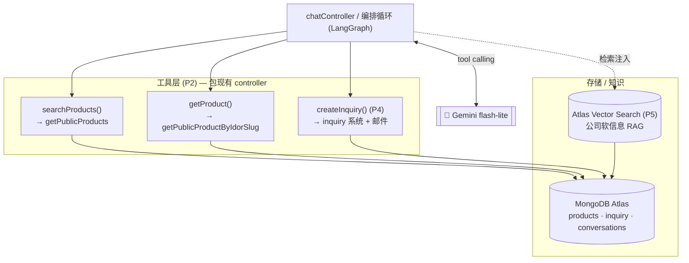

# 巨鑫售前 AI 助理 · Agent 说明

> 一个扎根真实产品库、能精确答规格、并把高意向访客沉淀为结构化询盘的 B2B 售前助理（代号 **Jason**）——严格止步于报价 / 库存 / 交期之前。
>
> 完整产品需求见 [`docs/agent-prd.html`](docs/agent-prd.html)。本文件聚焦**架构与工程实现**。

---

## 1. 它是什么

给巨鑫外贸官网加一个售前 AI 助理，把业务员重复回答的问题（MOQ、装箱量、能否 OEM 改色…）前置到官网自动答掉，并把访客转化成一条更完整的结构化询盘。

| 做（Must） | 不做（Non-Goal） |
| --- | --- |
| 产品规格问答、推荐/对比 | 实时报价（B2B 靠谈 → 引导留资） |
| 防幻觉 + 越界转人工 | 实时库存 / 交期（数据缺失，禁编造） |
| 抓询盘闭环（留资落库 + 邮件通知） | 下单 / 收款 |
| 多语言、匿名多轮对话 | —— |

定位：**售前助理**，不是成交客服。边界立得住，才不像玩具。

---

## 2. 架构图（当前 · P1）

前端聊天气泡 → 后端编排 → 模型。**system prompt 由后端注入，前端永远看不到、改不了**（防 prompt 注入）。



### 单次请求流程

1. 买家在气泡里发消息，前端把**完整 messages 历史**（模型无状态，历史即记忆）POST 到 `/api/chat`。
2. `chatController` 校验后，在最前面塞一条 `role:'system'` 的 `SYSTEM_PROMPT`。
3. `llm.js` 用 OpenAI 兼容 SDK 调 Gemini；撞到 429 限流会按服务器建议退避重试。
4. 回复返回前端，气泡渲染。conversationId 存 localStorage，留资时用来把对话关联到询盘（P4）。

---

## 3. 目标架构（P2 起接工具 / RAG / 记忆）

当前是"纯对话"。真正的价值在把现有业务接口包成 **tool** 让模型查真值：



> **硬约束**：规格 / MOQ / 装箱量必须走工具取真值，只复述工具返回内容，禁止模型自答；`createInquiry` 仅在已收集到 name + email 时才允许触发。

---

## 4. 文件结构

| 文件 | 职责 |
| --- | --- |
| `frontend/src/components/ChatWidget/ChatWidget.jsx` | 浮动气泡 UI（深色毛玻璃）+ messages 状态 + 提醒动画 |
| `frontend/src/services/chatService.js` | 调 `POST /api/chat` |
| `backend/src/routes/chat.js` | 路由 + 限速 |
| `backend/src/controllers/chatController.js` | 校验 + **注入 system prompt** + 调 LLM |
| `backend/src/agent/systemPrompt.js` | 助理人设、语言规则、A/B 边界、留资、防注入 |
| `backend/src/agent/llm.js` | LLM 客户端封装（provider 可切换）+ 429 退避 |
| `backend/src/utils/config.js` | LLM 环境变量集中管理 |

**system prompt 边界分两类**（见文件内注释）：
- **A 类**（规格 / MOQ / 装箱量…）：产品库里有，P1 暂说"待核实"，★P2 接工具后翻转为"必须调工具取真值"★。
- **B 类**（价格 / 库存 / 交期 / 下单）：库里没有，永远硬转人工。

---

## 5. 环境变量 / 切换模型

模型无关设计——换 provider 只改这三行，代码不动：

```bash
# Gemini（免费额度，墙外后端可用）
LLM_BASE_URL=https://generativelanguage.googleapis.com/v1beta/openai/
LLM_API_KEY=AIza...              # 或 AQ. 开头的新格式
LLM_MODEL=gemini-flash-lite-latest   # -latest 别名避免模型到期

# 国内后端可换：DeepSeek / 通义千问 DashScope / 智谱 GLM（均 OpenAI 兼容）
# LLM_BASE_URL=https://api.deepseek.com
# LLM_MODEL=deepseek-chat
```

> ⚠️ 免费额度按模型按天算，`gemini-flash-lite-latest` 约 1000~1500 次/天；接工具后一条消息会调 2~3 次模型，消耗更快。以 AI Studio 后台实时额度为准。

---

## 6. 里程碑

| 阶段 | 内容 | 状态 |
| --- | --- | --- |
| P0 | tool-calling 练手沙盒 | ✅ 完成 |
| P1 | `/api/chat` 纯对话 + 聊天气泡 | ✅ 完成 |
| P2 | 接工具（LangGraph 包产品接口）★核心 | ⬜ 下一步 |
| P3 | 防幻觉 + 护栏（部分已前置到 P1 prompt） | 🟡 部分 |
| P4 | 记忆 + 抓询盘闭环（conversations 落库） | ⬜ |
| P5 | RAG + 向量库（公司软信息） | ⬜ |
| P6 | eval 集 + 后台对话日志 | ⬜ |
| P7 | 部署（Render 环境变量） | ⬜ |
| P8 | 工具封装为 MCP server | ⬜ Stretch |

---

## 7. 本地运行

```bash
# 全栈（含本地 Mongo），生产同构
docker compose --profile dev up --build -d
# → http://localhost:3001

# 停
docker compose --profile dev down
```

仅前端热更新调试：`cd frontend && npm run dev`（Vite 代理 `/api` 到后端 3001）。
